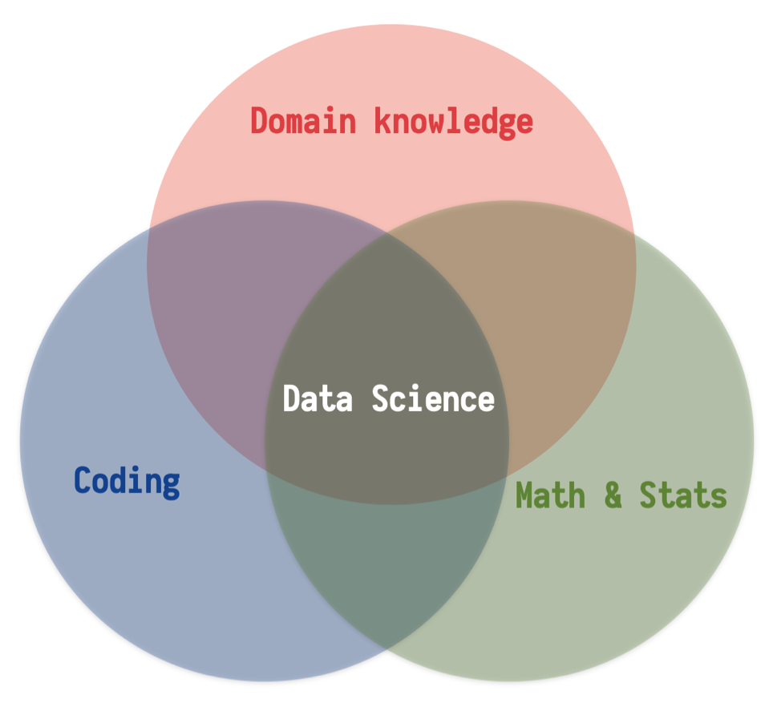
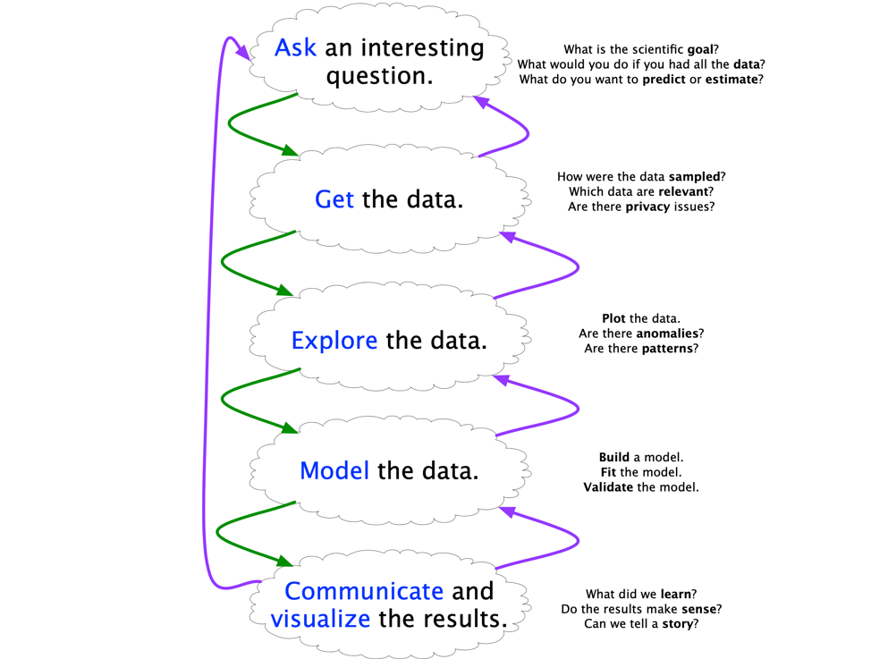

class: left, middle

```{r setup, include=FALSE}
options(htmltools.dir.version = FALSE)
knitr::opts_chunk$set(fig.align='center', echo = FALSE, out.width = '95%')
```


class: center, middle, inverse

.pull-left[
# Who am I?

]


.pull-right[
## Daijiang Li

### Assistant Professor 
 
### Department of Biological Sciences

### Center for Computation & Technology

### https://www.dlilab.com
]

---

# My role

.font200[
- Introuce new materials

- Help you learn these materials

- Help you learn how to use what we learned in your research

- Help you learn how to ask for help

- Be a potential future resource
]

---

# My role

.font200[
First time teaching this course
]

--

.font200[I plan to make .red[a lot] of mistakes or even fail]

--

.center[.font300[.red[In public]]]

---

class: center, middle, inverse

# Who are you?

???

Introduce yourself: department, lab, research direction/interest, etc.

---

class: center, middle, inverse

# Go Through the [Syllabus](https://introdatasci.dlilab.com/syllabus/)

---

# How are we going to go through this course?

### Learning by doing (through trials and errors)

### Use lots of online resources

### Peer-teaching and learning; collaborative coding

### Google and Stack Overflow


---

class: center, middle

# What is _data science_ ?

---

# Data science is interdisciplanary

.pull-left[
## To gain insights into data through ...
]

.pull-right[
```{r out.width = '100%'}

```
]

---
class: middle, inverse

.font200[
> Data Scientist = statistician + programmer + coach + storyteller + artist”  
>
> .right[Shlomo Aragmon]
]

.font200[
> Good data science is distinguished from bad data science primarily by a repeatable, thoughtful, skeptical application of an analytic process to data in order to arrive at supportable conclusions. 
>
> .right[Jeff Leek]

]

### Applies to every discipline

---

# The age of big data

.font150[
> Between the dawn of civilization and 2003, we only created five exabytes<sup>1</sup> of information; now we’re creating that amount every two days. 
>
> .right[Eric Schmidt et al, Google]

]

```{r out.width="85%"}
knitr::include_graphics("https://res.cloudinary.com/keystone-demo/image/upload/v1565024286/trinbmzk6iun61ny03ep.png")
```


.footnote[[1] 1 exabyte = 1 billion gigabytes]

???

ask students what kind of large datasets exist in their field of research


---

# Data science processes

.font200[
1. Define the question of interest

2. Get the data

3. Clean and prepare the data

4. Explore the data

5. Fit models to extract insights

6. Tell, explain, and illustrate results
]

---

# Data science processes

.font200[
1. Define the question of interest

2. .red[Get the data]

3. .red[Clean and prepare the data]

4. Explore the data

5. Fit models to extract insights

6. .red[Tell, explain, and illustrate results]
]

???

These steps are the most time consuming ones, so better to make them (and others) reproducible


---


.right[ Blitzstein & Pfister, 2015]

---

class: center, middle, inverse

# Questions in data science

---

background-image: url('figs/q_types.png')
background-position: 50% 50%
background-size: contain


.footnote[.font150[Leek & Peng 2015]]

---

# Examples

| Types                     | Examples                                                                         |
|---------------------------|----------------------------------------------------------------------------------|
| Descriptive               | Proportion of different races in the USA                                         |
| Exploratory               | Investigate correlations among multiple variables                                |
| Inferential (most common) | Does air pollution correlate with life expectancy at the state level in the USA? |
| Predictive                | Using polling data to predict election results; not necessarily explain why      |
| Causal                    | *Average* risk of COVID vs non-vaccination                                       |
| Mechanistic               | Impacts of wing design on air flow over a wing; rare outside of engineering      |


