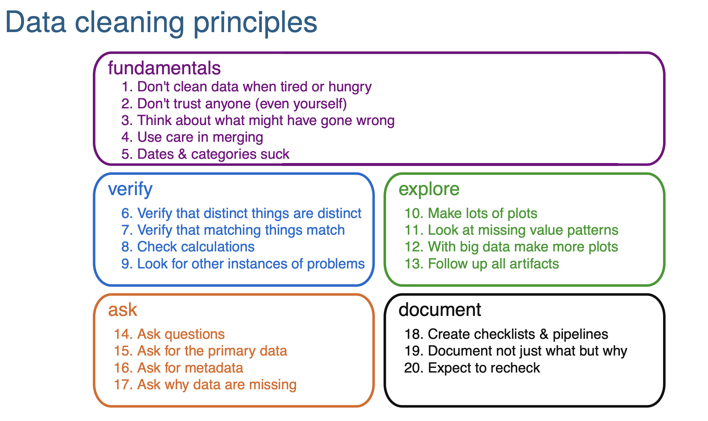

```{r setup, include=FALSE}
knitr::opts_chunk$set(echo = TRUE)
```

# Data cleaning -- broad concepts and principles

Today's topic is about data manipulation. Before we jump into the R functions, let's talk about what are data and data chain/wrokflow first.

Data are a set of values of qualitative or quantitative variables collected through observations.

*Raw data* have not been “cleaned” to remove outliers, instrument/observation errors, or data entry errors. Raw data can be relative: data may be raw to you, but they may have been pre-processed by someone prior to you receiving them.

Every one on the data chain should:

1. Keep a copy of the _raw_ data
2. Record all operations used to generate the _clean_ data
3. Document the contents of the _clean_ data (e.g., meaning of variable names, issues, etc.)

Spreadsheet is probably the most common way to enter and organize data for most cases (when data size is relatively small). If this applies to your own work, be sure to read this [**excellent data organization with spreadsheet slides**](https://kbroman.org/Talk_DataOrg/dataorg_notes.pdf).

Summary here:
1. Be consistent
2. Write dates as YYYY-MM-DD
3. Choose good names for things 
4. No empty cells
5. One thing per cell
6. Make it a rectangle
7. Make a data dictionary
8. No calculations in the data file 
9. No color/formatting as data
10. Make backups
11. Use data validation 
12. Save as plain text

Ok, with the above information, let's talk about data cleaning, which generally takes the most of project time (like 80%). This is probably because that data cleaning is hard to be generalized to every project. But there are some common principles. And below is an excellent [summary of data cleaning principles](https://kbroman.org/Talk_DataCleaning/data_cleaning_notes.pdf) provided by Dr. Karl Broman.



Please do make sure to read his notes along with the slides.
 
# Data cleaning -- useful functions that are regularly used
 
Based on the comments received from the class, it seems that I was trying to cover too many things in one lecture and was not able to go deep with most of them. I made the previous lectures very broad with the purpose to introduce useful ideas (e.g., git, github, command line, file systems, etc.) and functions that I think will be needed sometime for your future research. In the remaining lectures, I will try to be more focused and go deeper with each function.

Today, we will mainly introduce some functions from the `tidyverse` that I regularly use for daily work. Again, I will just focus on a very small proportion of them. To learn more, read the corresponding R packages' documentations!

First, let's get some datasets.

```{r eval=FALSE}
if(!require(remotes)) install.packages("remotes")
remotes::install_github("daijiang/neonDivData")
```
This data package has organismal data collected by [NEON](https://www.neonscience.org). You can get all the raw data from its [data portal](https://data.neonscience.org/data-products/explore) and R package [`neonUtilities`](https://cran.r-project.org/package=neonUtilities).

```{r}
library(neonDivData)
DT::datatable(head(neonDivData::data_bird, n = 100))
```


Wow, there are lots of variables! And believe it or not, this is actually already a "cleaned" version of the data. Normally, we'd check the data structure and look at what values does each variable contain. For example:

```{r}
str(neonDivData::data_bird)
table(neonDivData::data_bird$taxon_rank)
```

We will skip these steps and leave it to the "Exploratory data analysis" lecture.

Instead, I will introduce some functions by tasks.

## How to select some columns/variables? `select()`

This dataset is a data frame. So, we can always use the data frame subsetting codes we learned to select specific columns.

```{r}
data_bird[, c("siteID", "plotID", "pointID", "observation_datetime",
              "taxon_id", "taxon_name", "taxon_rank",
              "latitude", "longitude", "elevation")]
```

More conveniently, we can use the `select()` functions from `dplyr`.

```{r}
library(dplyr, warn.conflicts = FALSE)
select(data_bird, siteID, plotID, pointID, date_time = observation_datetime,
       starts_with("taxon"),
       latitude, longitude, elevation)
```

`select()` can be combined with other functions such as `ends_with()`, `everything()`, `matches()`, etc.

```{r}
select(data_bird, ends_with("name"))
select(data_bird, where(is.numeric))
select(data_bird, latitude, longitude, everything())
select(data_bird, c(1, 3, 5)) # by location
```

**Note** that sometimes the filter function will be covered by the `{raster::select}` function. If this is the case, try to be explicit and use `dplyr::select()`.

## How to remove some specific rows? `filter()`

Again, base R functions to subset data frames work here. But we will focus on the `dplyr::filter()` function. **Note** that sometimes the filter function will be covered by the `{stats::filter}` function. If you are not sure, just call the function `filter` [without `()`] in R and it will let you know which package it is from.

```{r}
filter(data_bird, plotID == "BART_025")
filter(data_bird, plotID == "BART_025", pointID == "C1") # a & b by default
filter(data_bird, plotID == "BART_025" | pointID == "C1") # a or b 
filter(data_bird, latitude > 40)
```

## How to add new columns or update existing columns? `mutate()`

With base R functions, we can do this with assignment.

```{r}
data_bird$new_column = data_bird$value * 10
```

Here is the `dplyr` way:

```{r}
# update existing column
mutate(data_bird, value = value + 1)
# create new column(s)
mutate(data_bird, new_column = value * 10)
# the created column can be used immediately
mutate(data_bird, 
       new_column = value * 10,
       newnew_col = new_column * 10
       )
mutate(data_bird, lat_band = ifelse(latitude > 45, "high", "low")) %>% 
  pull(lat_band) %>% 
  table()
# recode is very useful to correct values
mutate(data_bird, siteID = recode(siteID, "BART" = "BART2"))
```


 