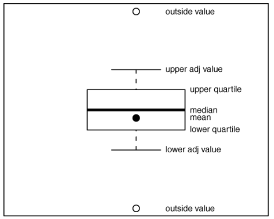

```{r setup, include=FALSE}
knitr::opts_chunk$set(echo = TRUE)
```

R includes three major different packages (systems) for plotting data: `graphics`, `lattice`, and `ggplot2`. `graphics` comes with R and is referred as base R plotting. It is easy to customize or modify charts with the `graphics` package, or to interact with them on the screen (interactive plot). The `lattice` package contains an alternative set of functions for plotting data. `Lattice` graphics are well suited for splitting data by a conditioning variable and they used to be quite popular. The third package (or a system) is `ggplot2`, with `gg` stands for `grammar of graphics`. `ggplot2` is probably the most popular package for plotting nowadays; hundreds of extra packages build on it to extend its capacity, making it a well developed system for plotting. We thus will focus mostly on `ggplot2`.

# Base R graphics

Here, I will only introduce several commonly used plotting function from the base R `graphics` package. They are useful to quickly plot something for data exploration. I personally use them frequently during data analysis. However, I now produce almost all figures in publications through `ggplot2`.


## Scatter plots to show relationship between two variables

To show a scatter plot, use the `plot` function.

```r
?plot.default
plot(x, y = NULL, type = "p", xlim = NULL, ylim = NULL, main = NULL, sub = NULL, 
     xlab = NULL, ylab = NULL, axes = TRUE, ...)
```


```{r}
plot(cars$dist, cars$speed)
plot(cars$dist, cars$speed, pch = 10, cex = 1.2, col = "blue")
```

Plot is a generic function (you can “plot” many different types of objects); `plot` can draw many types of objects, including vectors, tables, and time series. If you need to plot something generated by another package, chances are that package will work with `plot` to do that. For example, if we have a phylogeny, and `plot` can draw it.

```{r}
if(!require("ape")) install.packages("ape")
tree = ape::rtree(n = 10)
plot(tree)
```

## Histogram to show distribution of a continous varaible

When performing data analysis, it’s often very important to understand the shape of a data distribution. Looking at a distribution can tell you whether there are outliers in the data, or whether a certain modeling technique will work on your data, or simply how many observations are within a certain range of values.

The best known technique for visualizing a distribution is the histogram.

```{r}
hist(cars$speed)
hist(rnorm(n = 1000, mean = 2, sd = 2))
hist(rpois(n = 100, lambda = 1))
```

## Boxplot

Another very useful way to visualize a distribution is a box plot. A box plot is a compact way to show the distribution of a variable. The box shows the interquartile range. The interquartile range contains values between the 25th and 75th percentile; the line inside the box shows the median. The two “whiskers” on either side of the box show the adjacent values. The adjacent values are intended to show extreme values, but they don’t always extend to the absolute maximum or minimum value. The upper adjacent value is the value of the largest observation that is less than or equal to the upper quartile plus 1.5 times the length of the interquartile range; the lower adjacent value is the value of the smallest observation that is greater than or equal to the lower quartile less 1.5 times the length of the interquartile range. When there are values far outside the range we would expect for normally distributed data, those outlying values are plotted separately.




```{r}
boxplot(mtcars$mpg)
boxplot(mtcars$mpg ~ mtcars$cyl)
```

## Save figures as external files

Graphics in R are plotted on a graphics device. You can generate graphics in common formats using the `bmp`, `jpeg`, `png`, and `tiff` devices. Other devices include `postscript`, `pdf`, `pictex` (to generate LaTeX/PicTeX), `xfig`, and `bitmap`.

```{r eval=FALSE}
pdf(file = "file_name.pdf", width = 7, height = 5)
boxplot(mtcars$mpg ~ mtcars$cyl)
dev.off()
```

We can save multiple figures in one file, which can be useful when we explore the data.

```{r eval=FALSE}
pdf(file = "file_name.pdf", width = 7, height = 5, onefile = TRUE)
for(i in 1:8){
  set.seed(i)
  plot(1:10, rnorm(10))
}
dev.off()
```

# ggplot2

There is **NO WAY** to cover `ggplot2` in one lecture! I list some resources here so that you can learn it later.

- [ggplot2 package website](https://ggplot2.tidyverse.org/): **checkout the cheatsheet and lst of further resources there too**
- [A comprehensive list of ggplot2 resources](https://github.com/erikgahner/awesome-ggplot2)
- [Beautiful plotting in R: A ggplot2 cheatsheet](http://zevross.com/blog/2014/08/04/beautiful-plotting-in-r-a-ggplot2-cheatsheet-3/)
- [Comparing ggplot2 and R Base Graphics](https://flowingdata.com/2016/03/22/comparing-ggplot2-and-r-base-graphics/)


## A data visualization, is composed of geometric shapes, that take on aesthetics which represent variables from a data set. `ggplot()` + `aes()` + `geom_*()` or `ggplot(data, aes()) + geom_*()`

`ggplot2` is a package developed by Hadley Wickham (yes, he also developed the whole `tidyverse` with others) based on the idea of grammar of graphics – a concept created by Leland Wilkinson (Wilkinson 2005, a book). `ggplot2` graphics are built up from modular logical pieces, we can add layers with `+`.

`ggplot2` supports a continuum of expertise. One can get started right away and can also build complex, publication quality figures with some extra effort and prctice.

From the reading chapter: The components of ggplot2’s grammar of graphics are

- Basic:
1. one or more datasets, `ggplot2` works with data frames only, no vectors.
2. one or more geometric objects that serve as the visual representations of the data, – for instance, points, lines, rectangles, contours,
3. descriptions of how the variables in the data are mapped to visual properties (aesthetics) of the geometric objects, and an associated scale (e. g., linear, logarithmic, rank),
- Advanced:
4. one or more coordinate systems,
5. statistical summarization rules,
6. a facet specification, i.e. the use of multiple similar subplots to look at subsets of the same data,
7. optional parameters that affect the layout and rendering, such text size, font and alignment, legend positions.


Some terminology

- `ggplot` - The main function where you specify the dataset and
variables to plot
- `geoms` - geometric objects
    + `geom_point()`, `geom_bar()`, `geom_density()`, `geom_line()`, `geom_area()`, etc.
- `aes` - aesthetics
    + shape, transparency (alpha), color, fill, linetype.
- `scales` Define how your data will be plotted
    + continuous, discrete, log

## Examples

```{r}
head(iris)
```


```{r}
library(ggplot2)
ggplot(data = iris) # nothing yet
ggplot(data = iris) +
  geom_point(aes(x = Sepal.Length, y = Sepal.Width))
# can also set aes() within ggplot()
# this is ** Global setting **
ggplot(data = iris, aes(x = Sepal.Length, y = Sepal.Width)) + 
  geom_point()
# increase point size
myplot <- ggplot(data = iris, aes(x = Sepal.Length, y = Sepal.Width))
myplot + geom_point(size = 3)
# add color
myplot + geom_point(aes(color = Species), size = 3)
# different shape?
myplot + geom_point(aes(color = Species, shape = Species), size = 3)
```

### Exercise

Use the following dataset to produce the figure below:

```{r}
set.seed(123)
d <- diamonds[sample(1:nrow(diamonds), 1000), ]
```

```{r echo=FALSE}
ggplot(data = d, aes(x = carat, y = price, color = color)) +
  geom_point()
```


## More examples

```{r}
boxplot(mtcars$mpg ~ mtcars$cyl)
ggplot(mtcars, aes(x = as.factor(cyl), y = mpg)) +
  geom_boxplot()
hist(d2 <- rnorm(n = 1000, mean = 2, sd = 2))
# ggplot2 must work with a data frame, not a vector!
ggplot(as.data.frame(d2), aes(x = d2)) +
  geom_histogram()
ggplot(as.data.frame(d2), aes(x = d2)) +
  geom_histogram(binwidth = 1, color = "lightblue")
ggplot(as.data.frame(d2), aes(x = d2)) +
  geom_histogram(binwidth = 1, color = "lightblue", fill = "blue")
```

```{r}
library(dplyr, warn.conflicts = FALSE)
group_by(iris, Species) %>% summarise(l = sum(Sepal.Length))
# bar plot
ggplot(iris, aes(Species, Sepal.Length)) +
  geom_col()

(d3 <- tidyr::pivot_longer(iris, -Species))
ggplot(d3, aes(x = Species, y = value, fill = name)) +
  geom_col()

ggplot(d3, aes(x = Species, y = value, fill = name)) +
  geom_col(position = "dodge")
```

### Exercise

Use the `d3` dataset to generate the plot below:

```{r echo=FALSE}
ggplot(d3, aes(x = name, y = value, fill = Species)) +
  geom_col(position = "dodge")
```

## More examples

```{r}
# density plot
head(faithful)
ggplot(faithful, aes(x = waiting)) + geom_histogram()
ggplot(faithful, aes(x = waiting)) + geom_density()
ggplot(faithful, aes(x = waiting)) +
  geom_density(fill = "blue", alpha = 0.3)
```

## Colors!

Use color-blind friendly, print friendly colors!

Some useful links:

- [Colors in R](http://www.stat.columbia.edu/~tzheng/files/Rcolor.pdf)
- [R color cheatsheet](https://www.nceas.ucsb.edu/sites/default/files/2020-04/colorPaletteCheatsheet.pdf)
- [colorspace R package](https://cran.r-project.org/web/packages/colorspace/vignettes/colorspace.html)

```{r}
library(RColorBrewer)
display.brewer.all()
ggplot(d3, aes(x = Species, y = value, fill = name)) +
  geom_col(position = "dodge") +
  scale_fill_brewer(palette = "Set1")
ggplot(d3, aes(x = Species, y = value, fill = name)) +
  geom_col(position = "dodge") +
  scale_fill_viridis_d()
ggplot(d3, aes(x = Species, y = value, fill = name)) +
  geom_col(position = "dodge") +
  scale_fill_viridis_d(option = "magma")
```

## Facet

```{r}
ggplot(iris, aes(Sepal.Length, Sepal.Width, color = Species)) +
  geom_point() +
  facet_grid(Species ~ .)
ggplot(iris, aes(Sepal.Length, Sepal.Width, color = Species)) +
  geom_point() +
  facet_grid(Species ~ .) +
  theme(legend.position = "none") # remove legend
ggplot(iris, aes(Sepal.Length, Sepal.Width, color = Species)) +
  geom_point() +
  facet_grid(. ~ Species) +
  theme(legend.position = "none") # remove legend
ggplot(iris, aes(Sepal.Length, Sepal.Width, color = Species)) +
  geom_point() +
  facet_wrap(~ Species) +
  theme(legend.position = "none") # remove legend
```

## Add smoothers

```{r}
ggplot(iris, aes(Sepal.Length, Sepal.Width, color = Species)) +
  geom_point() +
  geom_smooth(method = "lm")
ggplot(iris, aes(Sepal.Length, Sepal.Width, color = Species)) +
  geom_point() +
  geom_smooth(method = "lm") +
  facet_wrap(~ Species) +
  theme(legend.position = "none") # remove legend
```

## More themes

```{r}
ggplot(iris, aes(Sepal.Length, Sepal.Width, color = Species)) +
  geom_point() +
  geom_smooth(method = "lm") +
  facet_wrap(~ Species) +
  labs(x = "Species length",
       y = "Sepal width",
       color = "Species names") +
  theme(legend.position = "bottom", 
        legend.key = element_rect(fill = NA),
        strip.background = element_rect(fill = NA)
        ) 

p = ggplot(iris, aes(Sepal.Length, Sepal.Width, color = Species)) +
  geom_point()
p + theme_bw() # comes with ggplot2
p + theme_dark()
p + theme_void()
p + theme_minimal()
```

There is a `ggthemes` package for you to use.

```{r}
library(ggthemes)
p + ggthemes::theme_excel()
p + ggthemes::theme_wsj()
p + ggthemes::theme_economist()
p + ggthemes::theme_solarized()
```

## Save ggplot figures

```{r eval=FALSE}
ggsave(filename = "path/to/figure.pdf", plot = p, 
       width = 7, height = 5)
```

## Putting multiple ggplot2 figures together

Sometimes we need to put multiple figures together as a larger figure. We won't cover this here, but you can check out these R packages:

- [cowplot](https://cran.r-project.org/web/packages/cowplot/vignettes/introduction.html)
- [patchwork](https://cran.r-project.org/web/packages/patchwork/vignettes/patchwork.html)


